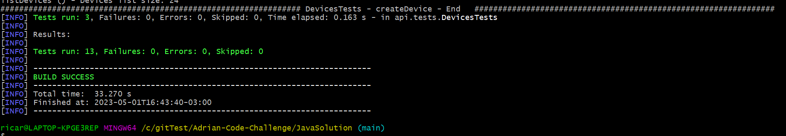
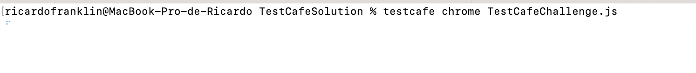
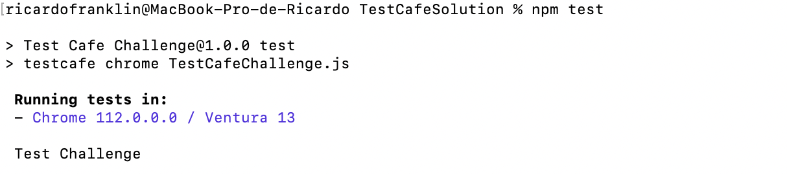
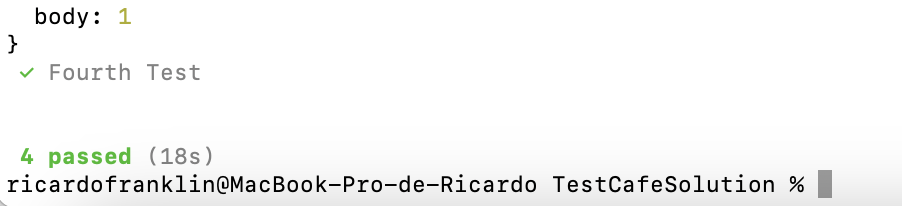

# Code-Challenge

---

## Java Solution (Selenium + Java + JUnit + RestAssured)

To Run the Java version, please execute the below command inside the JavaSolution folder (should have a pom.xml file inside that folder):

``` js

mvn clean test -Pexecution

```





## TestCafe Solution

To Run the TestCafe version, please execute one of the folling commands:

``` js

testcafe chrome <Jsfile>    

```

``` js

npm test

```


---

---



